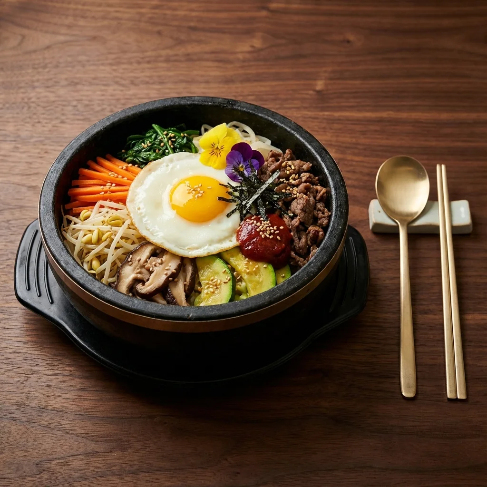
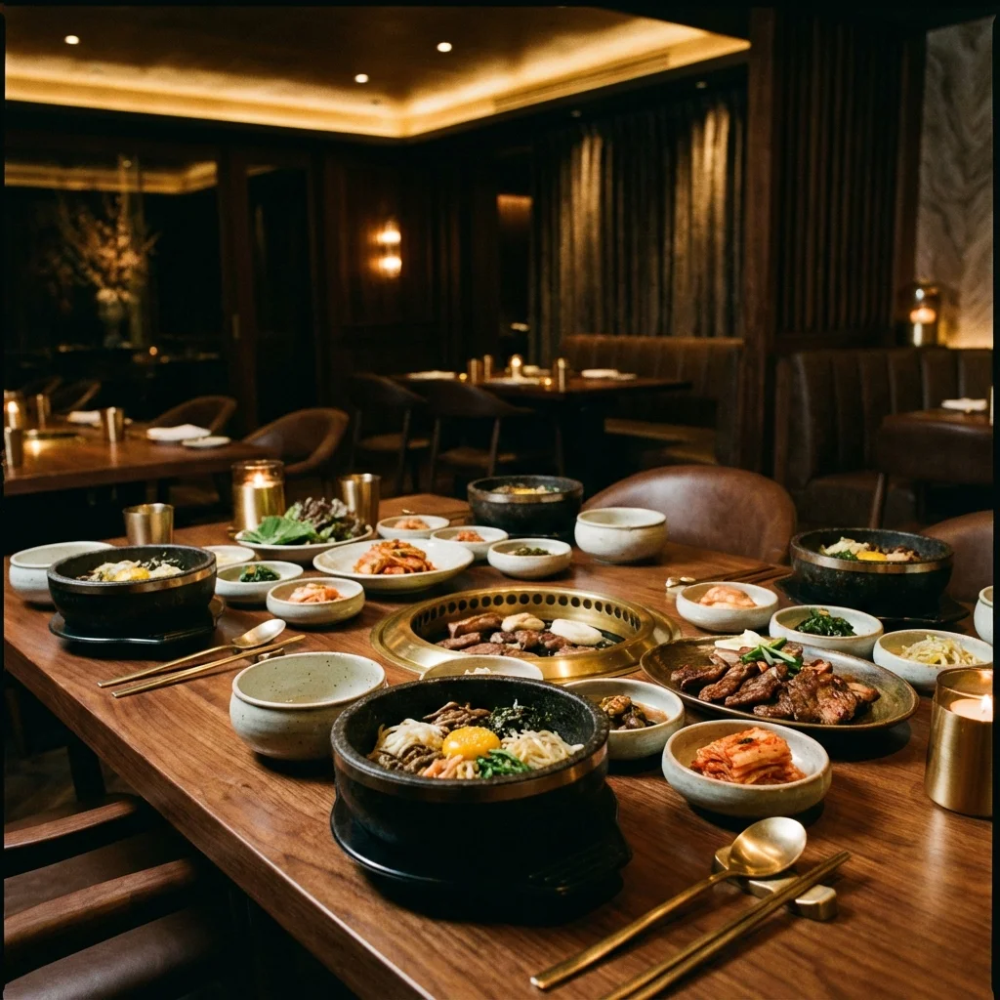

<!DOCTYPE html>
<html lang="de">

<head>
    <meta charset="UTF-8">
    <meta name="viewport" content="width=device-width, initial-scale=1.0">
    <meta name="robots" content="noindex, nofollow">
    <title>Sura | Koreanisches Restaurant in Dresden</title>

    <!-- Preload critical assets -->
    <link rel="preload" href="assets/images/hero.webp" as="image" type="image/webp">
    <link rel="preload" href="assets/fonts/outfit-latin.woff2" as="font" type="font/woff2" crossorigin>
    <link rel="preload" href="assets/fonts/playfair-latin.woff2" as="font" type="font/woff2" crossorigin>

    <!-- Critical CSS inlined for fast first paint (above-the-fold only) -->
    

    <!-- Full stylesheet -->
    <link rel="stylesheet" href="styles.css">

    <link rel="icon" href="assets/images/favicon.ico" type="image/x-icon">
</head>

<body>

    <a href="#main-content" class="skip-to-content">Zum Hauptinhalt springen</a>

    <nav id="navbar" role="navigation" aria-label="Hauptnavigation">
        <a href="#" class="brand" aria-label="Sura - Zur Startseite">SURA</a>
        

            

                <button class="lang-btn" data-lang="en" aria-label="Switch to English">EN</button>
                <button class="lang-btn active" data-lang="de" aria-label="Deutsch ausgewählt" aria-pressed="true">DE</button>
            

            <a href="#home" data-i18n="nav_home">Home</a>
            <a href="#about" data-i18n="nav_about">Über Uns</a>
            <a href="#experience" data-i18n="nav_menu">Menu</a>
            <a href="#location" data-i18n="nav_location">Location</a>
            <a href="#reservation" id="navReservation" data-i18n="nav_reservation">Reservierung</a>
        

        

            

                <button class="lang-btn" data-lang="en" aria-label="Switch to English">EN</button>
                <button class="lang-btn active" data-lang="de" aria-label="Deutsch ausgewählt" aria-pressed="true">DE</button>
            

            <button class="mobile-nav-toggle" id="mobileNavToggle" aria-label="Menü öffnen" aria-expanded="false" aria-controls="navLinks">
                
                
                
            </button>
        

    </nav>

    <main role="main" id="main-content">
    <section id="home" class="hero" aria-labelledby="hero-title">
        <h1 id="hero-title" data-i18n="hero_title">The King's Table</h1>
        
A modern interpretation of royal Korean cuisine. Elevating traditional flavors through
            contemporary techniques and seasonal ingredients.

        

            <a href="assets/menu.pdf" class="btn" target="_blank" data-i18n="hero_btn">Speisekarte</a>
            <a href="#reservation" class="btn" id="heroReservation" data-i18n="hero_reservation">Tisch reservieren</a>
        

    </section>

    <section id="about" class="info-section" aria-labelledby="about-title">
        

            Unsere Geschichte
            <h2 id="about-title" data-i18n="about_title">Über Uns</h2>
            

                Das Sura wurde 2020 mit einer klaren Vision gegründet: Die authentische koreanische Küche nach Dresden zu bringen.
                Unser Name "Sura" stammt vom koreanischen Wort für die königliche Tafel – ein Symbol für die höchste Qualität und Sorgfalt bei der Zubereitung.
            

            

                Jedes Gericht wird mit frischen Zutaten und nach traditionellen Rezepten zubereitet, die von Generation zu Generation weitergegeben wurden.
                Wir laden Sie ein, die Vielfalt der koreanischen Küche zu entdecken – von würzigem Kimchi bis hin zu zartem Bulgogi.
            

        

        

            
        

    </section>

    <section id="experience" class="info-section" aria-labelledby="experience-title">
        

            Atmosphere
            <h2 id="experience-title" data-i18n="exp_title">An Elevated Experience</h2>
            
At Sura, we believe dining is more
                than just a meal. It's a journey through history, culture, and craftsmanship. Our space combines minimal
                Korean aesthetics with modern luxury to create an íntimate environment for unforgettable moments.

            <a href="assets/menu.pdf" class="btn" target="_blank" data-i18n="menu_btn">Speisekarte (PDF)</a>
        

        

            
        

</section>

<section id="location" style="background-color: var(--bg-dark);" aria-labelledby="location-title">
        

            Join Us
            <h2 id="location-title" data-i18n="loc_title">Location & Hours</h2>
        

        

            

                

                    <h3 style="color: var(--primary-color); margin-bottom: 1rem;" data-i18n="loc_address">Address</h3>
                    
Königsbrücker Straße 50 01099 Dresden

                

                

                    <h3 style="color: var(--primary-color); margin-bottom: 1rem;" data-i18n="loc_hours">Opening Hours</h3>
                    
Dienstag - Sonntag: 17:00 - 22:00 Montag: Ruhetag

                

                

                    <h3 style="color: var(--primary-color); margin-bottom: 1rem;" data-i18n="loc_contact">Contact</h3>
                    
<a href="tel:+4935181074789" style="color: inherit; text-decoration: none;">0351 810 747 89</a> 
                       <a href="mailto:suradresden@gmail.com" style="color: inherit; text-decoration: none;">suradresden@gmail.com</a>

                

            

            

                

                    <svg xmlns="http://www.w3.org/2000/svg" width="48" height="48" viewBox="0 0 24 24" fill="none" stroke="currentColor" stroke-width="1.5" stroke-linecap="round" stroke-linejoin="round"><path d="M21 10c0 7-9 13-9 13s-9-6-9-13a9 9 0 0 1 18 0z"></path><circle cx="12" cy="10" r="3"></circle></svg>
                    
Klicken Sie hier, um Google Maps zu laden. Dabei werden Daten an Google übertragen.

                    <button id="loadMapBtn" class="btn" data-i18n="map_consent_btn">Karte laden</button>
                

                <iframe id="googleMap" data-src="https://www.google.com/maps/embed?pb=!1m18!1m12!1m3!1d2507.1308701221797!2d13.746738177751032!3d51.069134171716925!2m3!1f0!2f0!3f0!3m2!1i1024!2i768!4f13.1!3m3!1m2!1s0x4709cf3d87677705%3A0xa89993fea0eaa95f!2sSura%20Restaurant!5e0!3m2!1sen!2sde!4v1767011093448!5m2!1sen!2sde" width="100%" height="300" style="border:0; display: none;" allowfullscreen="" referrerpolicy="no-referrer-when-downgrade" title="Google Maps - Sura Restaurant Dresden"></iframe>
            

        

</section>

<section id="reviews">
        

            <h2 data-i18n="reviews_title">Reviews</h2>
        

        

        

            <a href="https://maps.app.goo.gl/NY1SnsnVozmhaia19" target="_blank" rel="noopener noreferrer" class="review-widget google-widget" aria-label="Sura Restaurant auf Google Reviews ansehen">
                

                    <svg class="google-logo" viewBox="0 0 24 24" width="24" height="24">
                        <path fill="#4285F4" d="M22.56 12.25c0-.78-.07-1.53-.2-2.25H12v4.26h5.92c-.26 1.37-1.04 2.53-2.21 3.31v2.77h3.57c2.08-1.92 3.28-4.74 3.28-8.09z"/>
                        <path fill="#34A853" d="M12 23c2.97 0 5.46-.98 7.28-2.66l-3.57-2.77c-.98.66-2.23 1.06-3.71 1.06-2.86 0-5.29-1.93-6.16-4.53H2.18v2.84C3.99 20.53 7.7 23 12 23z"/>
                        <path fill="#FBBC05" d="M5.84 14.09c-.22-.66-.35-1.36-.35-2.09s.13-1.43.35-2.09V7.07H2.18C1.43 8.55 1 10.22 1 12s.43 3.45 1.18 4.93l2.85-2.22.81-.62z"/>
                        <path fill="#EA4335" d="M12 5.38c1.62 0 3.06.56 4.21 1.64l3.15-3.15C17.45 2.09 14.97 1 12 1 7.7 1 3.99 3.47 2.18 7.07l3.66 2.84c.87-2.6 3.3-4.53 6.16-4.53z"/>
                    </svg>
                    Google Reviews
                

                

                    4.5
                    

                        &#9733;
                        &#9733;
                        &#9733;
                        &#9733;
                        &#9733;
                    

                

                

                    1.037 Bewertungen
                

                

                    Bewertungen ansehen
                    <svg width="16" height="16" viewBox="0 0 24 24" fill="none" stroke="currentColor" stroke-width="2"><path d="M5 12h14M12 5l7 7-7 7"/></svg>
                

            </a>
            <a href="https://www.tripadvisor.de/Restaurant_Review-g187399-d5975431-Reviews-SURA_Dresden-Dresden_Saxony.html" target="_blank" rel="noopener noreferrer" class="review-widget tripadvisor-widget" aria-label="Sura Restaurant auf TripAdvisor ansehen">
                

                    <svg class="tripadvisor-logo" viewBox="0 0 24 24" width="28" height="28">
                        <path fill="#34E0A1" d="M12.006 4.295c-2.67 0-5.338.784-7.645 2.353H0l1.963 2.135a5.997 5.997 0 0 0 4.04 10.43 5.976 5.976 0 0 0 4.075-1.6L12 19.705l1.922-2.09a5.972 5.972 0 0 0 4.072 1.598 6 6 0 0 0 6-5.998 5.982 5.982 0 0 0-1.957-4.432L24 6.648h-4.35a13.573 13.573 0 0 0-7.644-2.353zM12 6.255c1.531 0 3.063.303 4.504.903C13.943 8.138 12 10.43 12 13.1c0-2.671-1.942-4.962-4.504-5.942A11.72 11.72 0 0 1 12 6.256zM6.002 9.157a4.059 4.059 0 1 1 0 8.118 4.059 4.059 0 0 1 0-8.118zm11.992.002a4.057 4.057 0 1 1 .003 8.115 4.057 4.057 0 0 1-.003-8.115zm-11.992 1.93a2.128 2.128 0 0 0 0 4.256 2.128 2.128 0 0 0 0-4.256zm11.992 0a2.128 2.128 0 0 0 0 4.256 2.128 2.128 0 0 0 0-4.256z"/>
                    </svg>
                    TripAdvisor
                

                

                    4.2
                    

                        
                        
                        
                        
                        
                    

                

                

                    73 Bewertungen
                

                

                    Bewertungen ansehen
                    <svg width="16" height="16" viewBox="0 0 24 24" fill="none" stroke="currentColor" stroke-width="2"><path d="M5 12h14M12 5l7 7-7 7"/></svg>
                

            </a>
        

        
Stand: Januar 2026

        

</section>

</main>

    <footer role="contentinfo">
        
SURA

        

            
&copy; 2025 Sura Korean Restaurant Dresden. All rights reserved.

            

                <a href="/restaurant/datenschutz/" data-i18n="footer_privacy">Datenschutz</a>
                |
                <a href="/restaurant/impressum/" data-i18n="footer_imprint">Impressum</a>
            

        

    </footer>

    <!-- Reservation Modal -->
    

        

        

            <button class="modal-close" id="closeModal" aria-label="Schließen">&times;</button>
            

                <h2 id="modalTitle" data-i18n="loc_reservation">Reservierung</h2>
            

            

                
Tischreservierung telefonisch unter <a href="tel:+4935181074789" class="phone-link">0351 810 747 89</a>

                <a href="tel:+4935181074789" class="btn" style="margin-top: 1.5rem; display: block; text-align: center;" data-i18n="loc_call_now">Jetzt anrufen</a>
            

        

    

    <!-- Back to Top Button -->
    <button id="backToTop" class="back-to-top" aria-label="Nach oben scrollen">
        <svg xmlns="http://www.w3.org/2000/svg" width="24" height="24" viewBox="0 0 24 24" fill="none" stroke="currentColor" stroke-width="2" stroke-linecap="round" stroke-linejoin="round"><polyline points="18 15 12 9 6 15"></polyline></svg>
    </button>

    
    
</body>

</html>