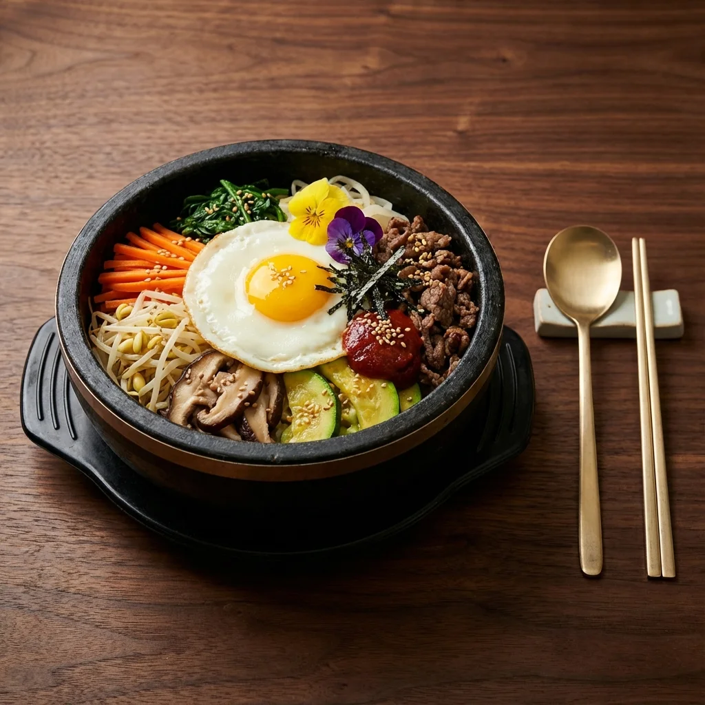
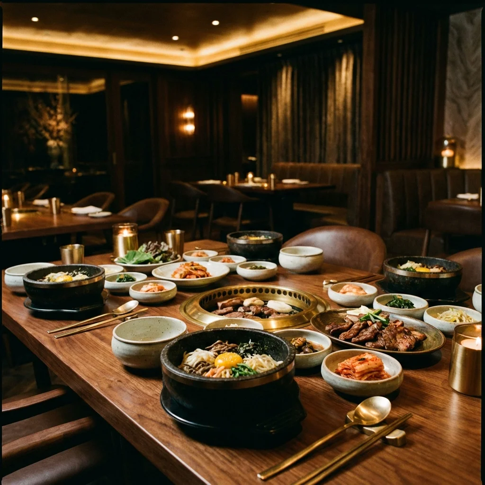

<!DOCTYPE html>
<html lang="de">

<head>
    <meta charset="UTF-8">
    <meta name="viewport" content="width=device-width, initial-scale=1.0">
    <meta name="robots" content="noindex, nofollow">
    <title>Sura | Koreanisches Restaurant in Dresden</title>

    <!-- Preload critical assets -->
    <link rel="preload" href="assets/images/hero.webp" as="image" type="image/webp">
    <link rel="preload" href="assets/fonts/outfit-latin.woff2" as="font" type="font/woff2" crossorigin>
    <link rel="preload" href="assets/fonts/playfair-latin.woff2" as="font" type="font/woff2" crossorigin>

    <!-- Critical CSS inlined for fast first paint (above-the-fold only) -->
    

    <!-- Full stylesheet -->
    <link rel="stylesheet" href="styles.css">

    <!-- Ensure content is visible if JavaScript is unavailable -->
    <noscript>
        
    </noscript>

    <link rel="icon" href="assets/images/favicon.ico" type="image/x-icon">
</head>

<body>

    <a href="#main-content" class="skip-to-content">Zum Hauptinhalt springen</a>

    <nav id="navbar" role="navigation" aria-label="Hauptnavigation">
        <a href="#home" class="brand" aria-label="Sura - Zur Startseite">SURA</a>
        

            

                <button class="lang-btn" data-lang="en" aria-label="Switch to English">EN</button>
                <button class="lang-btn active" data-lang="de" aria-label="Deutsch ausgewählt" aria-pressed="true">DE</button>
            

            <a href="#home" data-i18n="nav_home">Home</a>
            <a href="#about" data-i18n="nav_about">Über Uns</a>
            <a href="#experience" data-i18n="nav_menu">Menu</a>
            <a href="#location" data-i18n="nav_location">Location</a>
            <a href="#reservation" id="navReservation" data-i18n="nav_reservation">Reservierung</a>
        

        

            

                <button class="lang-btn" data-lang="en" aria-label="Switch to English">EN</button>
                <button class="lang-btn active" data-lang="de" aria-label="Deutsch ausgewählt" aria-pressed="true">DE</button>
            

            <button class="mobile-nav-toggle" id="mobileNavToggle" aria-label="Menü öffnen" aria-expanded="false" aria-controls="navLinks">
                
                
                
            </button>
        

    </nav>

    <main role="main" id="main-content">

    <!-- Hero -->
    <section id="home" class="hero" aria-labelledby="hero-title">
        

        

        수라 · Koreanische Küche · Dresden
        <h1 id="hero-title" class="anim d2" data-i18n="hero_title">Sura Dresden</h1>
        
Eine moderne Interpretation der königlichen koreanischen Küche –
            traditionelle Aromen, zeitgemäß und mit saisonalen Zutaten neu erzählt.

        

            <a href="assets/menu.pdf" class="btn" target="_blank" rel="noopener" data-i18n="hero_btn">Speisekarte</a>
            <a href="#reservation" class="btn btn--ghost" id="heroReservation" data-i18n="hero_reservation">Tisch reservieren</a>
        

        

            
        

    </section>

    <!-- About -->
    <section id="about" class="section section--cream" aria-labelledby="about-title">
        

            

                

                    01Unsere Geschichte
                    <h2 id="about-title" class="section-title" data-i18n="about_title">Über Uns</h2>
                    
Das Sura wurde 2020 mit einer klaren Vision gegründet: Die authentische
                        koreanische Küche nach Dresden zu bringen. Unser Name „Sura" stammt vom koreanischen Wort für die
                        königliche Tafel – ein Symbol für höchste Qualität und Sorgfalt.

                    
Jedes Gericht wird mit frischen Zutaten und nach traditionellen Rezepten
                        zubereitet, die von Generation zu Generation weitergegeben wurden.

                

                

                    

                        
                    

                    

                        <strong>2020</strong>
                        Gegründet
                    

                

            

        

    </section>

    <!-- Experience -->
    <section id="experience" class="section section--dark" aria-labelledby="experience-title">
        

            

                

                    02Atmosphäre
                    <h2 id="experience-title" class="section-title" data-i18n="exp_title">Willkommen im Sura</h2>
                    
Gelegen in der Königsbrücker Straße 50, ist das Sura die Adresse für
                        authentische koreanische Küche in Dresden. Verweilen, entspannen und sich von traditionellen
                        Aromen verzaubern lassen.

                    <a href="assets/menu.pdf" class="btn btn--ghost" target="_blank" rel="noopener" data-i18n="menu_btn" style="margin-top:0.6rem;">Speisekarte (PDF)</a>
                

                

                    

                        
                    

                

            

        

    </section>

    <!-- Location & Hours -->
    <section id="location" class="section section--darker" aria-labelledby="location-title">
        

            

                Besuchen Sie uns
                <h2 id="location-title" class="section-title" data-i18n="loc_title">Standort &amp; Zeiten</h2>
            

            

                

                    

                        <h3 data-i18n="loc_address">Adresse</h3>
                        
Königsbrücker Straße 50 01099 Dresden

                    

                    

                        <h3 data-i18n="loc_hours">Öffnungszeiten</h3>
                        
Dienstag – Sonntag: 17:00 – 22:00 Uhr Montag: Ruhetag

                    

                    

                        <h3 data-i18n="loc_contact">Kontakt</h3>
                        
<a href="tel:+4935181074789">0351 810 747 89</a> 
                           <a href="mailto:suradresden@gmail.com">suradresden@gmail.com</a>

                    

                

                

                    

                        <svg xmlns="http://www.w3.org/2000/svg" width="48" height="48" viewBox="0 0 24 24" fill="none" stroke="currentColor" stroke-width="1.5" stroke-linecap="round" stroke-linejoin="round"><path d="M21 10c0 7-9 13-9 13s-9-6-9-13a9 9 0 0 1 18 0z"></path><circle cx="12" cy="10" r="3"></circle></svg>
                        
Klicken Sie hier, um Google Maps zu laden. Dabei werden Daten an Google übertragen.

                        <button id="loadMapBtn" class="btn" data-i18n="map_consent_btn">Karte laden</button>
                    

                    <iframe id="googleMap" data-src="https://www.google.com/maps/embed?pb=!1m18!1m12!1m3!1d2507.1308701221797!2d13.746738177751032!3d51.069134171716925!2m3!1f0!2f0!3f0!3m2!1i1024!2i768!4f13.1!3m3!1m2!1s0x4709cf3d87677705%3A0xa89993fea0eaa95f!2sSura%20Restaurant!5e0!3m2!1sen!2sde!4v1767011093448!5m2!1sen!2sde" width="100%" height="340" style="border:0; display: none;" allowfullscreen="" referrerpolicy="no-referrer-when-downgrade" title="Google Maps - Sura Restaurant Dresden"></iframe>
                

            

        

    </section>

    <!-- Testimonials -->
    <section id="voices" class="section section--dark testimonials" aria-labelledby="testimonials-title">
        

            

                Kundenstimmen
                <h2 id="testimonials-title" class="section-title" data-i18n="testimonials_title">Was unsere Gäste sagen</h2>
            

            

                

                    <figure class="testimonial-card">
                        &ldquo;
                        
Das beste koreanische Essen außerhalb Koreas! Das Bulgogi war unglaublich zart.

                        
&#9733;&#9733;&#9733;&#9733;&#9733;

                    </figure>
                    <figure class="testimonial-card">
                        &ldquo;
                        
Authentisch, lecker und mit Liebe zubereitet. Das Bibimbap im heißen Steintopf ist ein Muss!

                        
&#9733;&#9733;&#9733;&#9733;&#9733;

                    </figure>
                    <figure class="testimonial-card">
                        &ldquo;
                        
Endlich echte koreanische Küche in Dresden! Das Kimchi Jjigae schmeckt wie bei meiner Oma in Seoul.

                        
&#9733;&#9733;&#9733;&#9733;&#9733;

                    </figure>
                    <figure class="testimonial-card">
                        &ldquo;
                        
Von der Eleganz der Aromen beeindruckt. Ein wirklich erstklassiges Restauranterlebnis.

                        
&#9733;&#9733;&#9733;&#9733;&#9733;

                    </figure>
                    <figure class="testimonial-card">
                        &ldquo;
                        
Die Atmosphäre ist fantastisch, perfekt für ein romantisches Abendessen. Sehr zu empfehlen!

                        
&#9733;&#9733;&#9733;&#9733;&#9733;

                    </figure>
                    <figure class="testimonial-card">
                        &ldquo;
                        
Das beste Bibimbap der Stadt. Die Zutaten sind so frisch und der Steintopf blieb bis zum letzten Bissen heiß!

                        
&#9733;&#9733;&#9733;&#9733;&#9733;

                    </figure>
                

            

            

                <button class="slider-btn prev" id="testiPrev" aria-label="Vorherige Bewertung">
                    <svg width="20" height="20" viewBox="0 0 24 24" fill="none" stroke="currentColor" stroke-width="2"><path d="M15 18l-6-6 6-6"/></svg>
                </button>
                

                <button class="slider-btn next" id="testiNext" aria-label="Nächste Bewertung">
                    <svg width="20" height="20" viewBox="0 0 24 24" fill="none" stroke="currentColor" stroke-width="2"><path d="M9 6l6 6-6 6"/></svg>
                </button>
            

        

    </section>

    <!-- Reviews -->
    <section id="reviews" class="section section--darker" aria-labelledby="reviews-title">
        

            

                <h2 id="reviews-title" class="section-title" data-i18n="reviews_title">Bewertungen</h2>
            

            

            

                <a href="https://maps.app.goo.gl/NY1SnsnVozmhaia19" target="_blank" rel="noopener noreferrer" class="review-widget google-widget" aria-label="Sura Restaurant auf Google Reviews ansehen">
                    

                        <svg class="google-logo" viewBox="0 0 24 24" width="24" height="24">
                            <path fill="#4285F4" d="M22.56 12.25c0-.78-.07-1.53-.2-2.25H12v4.26h5.92c-.26 1.37-1.04 2.53-2.21 3.31v2.77h3.57c2.08-1.92 3.28-4.74 3.28-8.09z"/>
                            <path fill="#34A853" d="M12 23c2.97 0 5.46-.98 7.28-2.66l-3.57-2.77c-.98.66-2.23 1.06-3.71 1.06-2.86 0-5.29-1.93-6.16-4.53H2.18v2.84C3.99 20.53 7.7 23 12 23z"/>
                            <path fill="#FBBC05" d="M5.84 14.09c-.22-.66-.35-1.36-.35-2.09s.13-1.43.35-2.09V7.07H2.18C1.43 8.55 1 10.22 1 12s.43 3.45 1.18 4.93l2.85-2.22.81-.62z"/>
                            <path fill="#EA4335" d="M12 5.38c1.62 0 3.06.56 4.21 1.64l3.15-3.15C17.45 2.09 14.97 1 12 1 7.7 1 3.99 3.47 2.18 7.07l3.66 2.84c.87-2.6 3.3-4.53 6.16-4.53z"/>
                        </svg>
                        Google Reviews
                    

                    

                        4.5
                        

                            &#9733;
                            &#9733;
                            &#9733;
                            &#9733;
                            &#9733;
                        

                    

                    

                        1.037 Bewertungen
                    

                    

                        Bewertungen ansehen
                        <svg width="16" height="16" viewBox="0 0 24 24" fill="none" stroke="currentColor" stroke-width="2"><path d="M5 12h14M12 5l7 7-7 7"/></svg>
                    

                </a>
                <a href="https://www.tripadvisor.de/Restaurant_Review-g187399-d5975431-Reviews-SURA_Dresden-Dresden_Saxony.html" target="_blank" rel="noopener noreferrer" class="review-widget tripadvisor-widget" aria-label="Sura Restaurant auf TripAdvisor ansehen">
                    

                        <svg class="tripadvisor-logo" viewBox="0 0 24 24" width="28" height="28">
                            <path fill="#34E0A1" d="M12.006 4.295c-2.67 0-5.338.784-7.645 2.353H0l1.963 2.135a5.997 5.997 0 0 0 4.04 10.43 5.976 5.976 0 0 0 4.075-1.6L12 19.705l1.922-2.09a5.972 5.972 0 0 0 4.072 1.598 6 6 0 0 0 6-5.998 5.982 5.982 0 0 0-1.957-4.432L24 6.648h-4.35a13.573 13.573 0 0 0-7.644-2.353zM12 6.255c1.531 0 3.063.303 4.504.903C13.943 8.138 12 10.43 12 13.1c0-2.671-1.942-4.962-4.504-5.942A11.72 11.72 0 0 1 12 6.256zM6.002 9.157a4.059 4.059 0 1 1 0 8.118 4.059 4.059 0 0 1 0-8.118zm11.992.002a4.057 4.057 0 1 1 .003 8.115 4.057 4.057 0 0 1-.003-8.115zm-11.992 1.93a2.128 2.128 0 0 0 0 4.256 2.128 2.128 0 0 0 0-4.256zm11.992 0a2.128 2.128 0 0 0 0 4.256 2.128 2.128 0 0 0 0-4.256z"/>
                        </svg>
                        TripAdvisor
                    

                    

                        4.2
                        

                            
                            
                            
                            
                            
                        

                    

                    

                        73 Bewertungen
                    

                    

                        Bewertungen ansehen
                        <svg width="16" height="16" viewBox="0 0 24 24" fill="none" stroke="currentColor" stroke-width="2"><path d="M5 12h14M12 5l7 7-7 7"/></svg>
                    

                </a>
            

            
Stand: Januar 2026

            

        

    </section>

    <!-- Reservation band -->
    <section class="reserve-band" aria-labelledby="reserve-title">
        

            Reservierung
            <h2 id="reserve-title" data-i18n="reserve_title">Ein Platz an der königlichen Tafel</h2>
            
Sichern Sie sich Ihren Tisch und erleben Sie die koreanische Küche im Herzen der Dresdner Neustadt.

            <a href="#reservation" class="btn" id="bandReservation" data-i18n="hero_reservation">Tisch reservieren</a>
        

    </section>

    </main>

    <footer role="contentinfo">
        
SURA

        

            
&copy; 2025 Sura Korean Restaurant Dresden. All rights reserved.

            

                <a href="/restaurant/datenschutz/" data-i18n="footer_privacy">Datenschutz</a>
                |
                <a href="/restaurant/impressum/" data-i18n="footer_imprint">Impressum</a>
            

        

    </footer>

    <!-- Reservation Modal -->
    

        

        

            <button class="modal-close" id="closeModal" aria-label="Schließen">&times;</button>
            

                <h2 id="modalTitle" data-i18n="loc_reservation">Reservierung</h2>
            

            

                
Tischreservierung telefonisch unter <a href="tel:+4935181074789" class="phone-link">0351 810 747 89</a>

                <a href="tel:+4935181074789" class="btn" style="margin-top: 1.5rem; display: block; text-align: center;" data-i18n="loc_call_now">Jetzt anrufen</a>
            

        

    

    <!-- Back to Top Button -->
    <button id="backToTop" class="back-to-top" aria-label="Nach oben scrollen">
        <svg xmlns="http://www.w3.org/2000/svg" width="24" height="24" viewBox="0 0 24 24" fill="none" stroke="currentColor" stroke-width="2" stroke-linecap="round" stroke-linejoin="round"><polyline points="18 15 12 9 6 15"></polyline></svg>
    </button>

    
    
</body>

</html>
