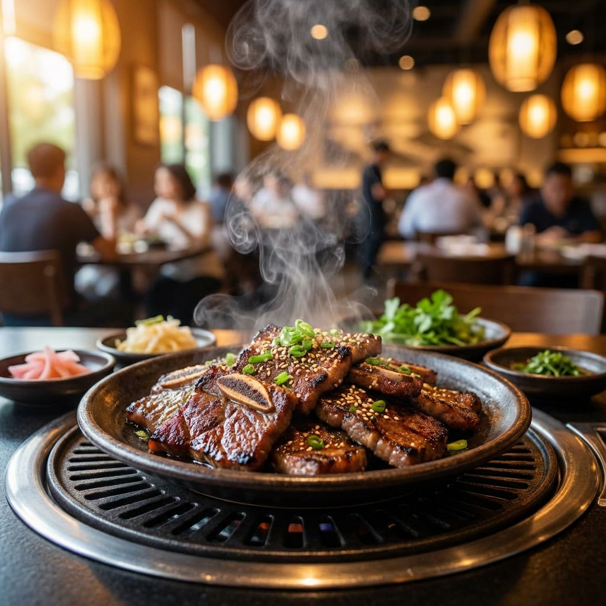
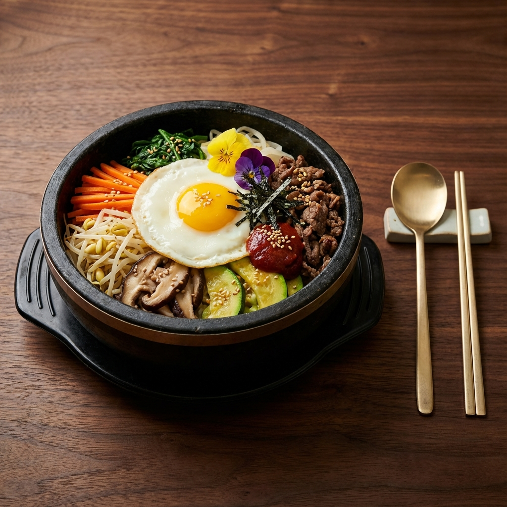
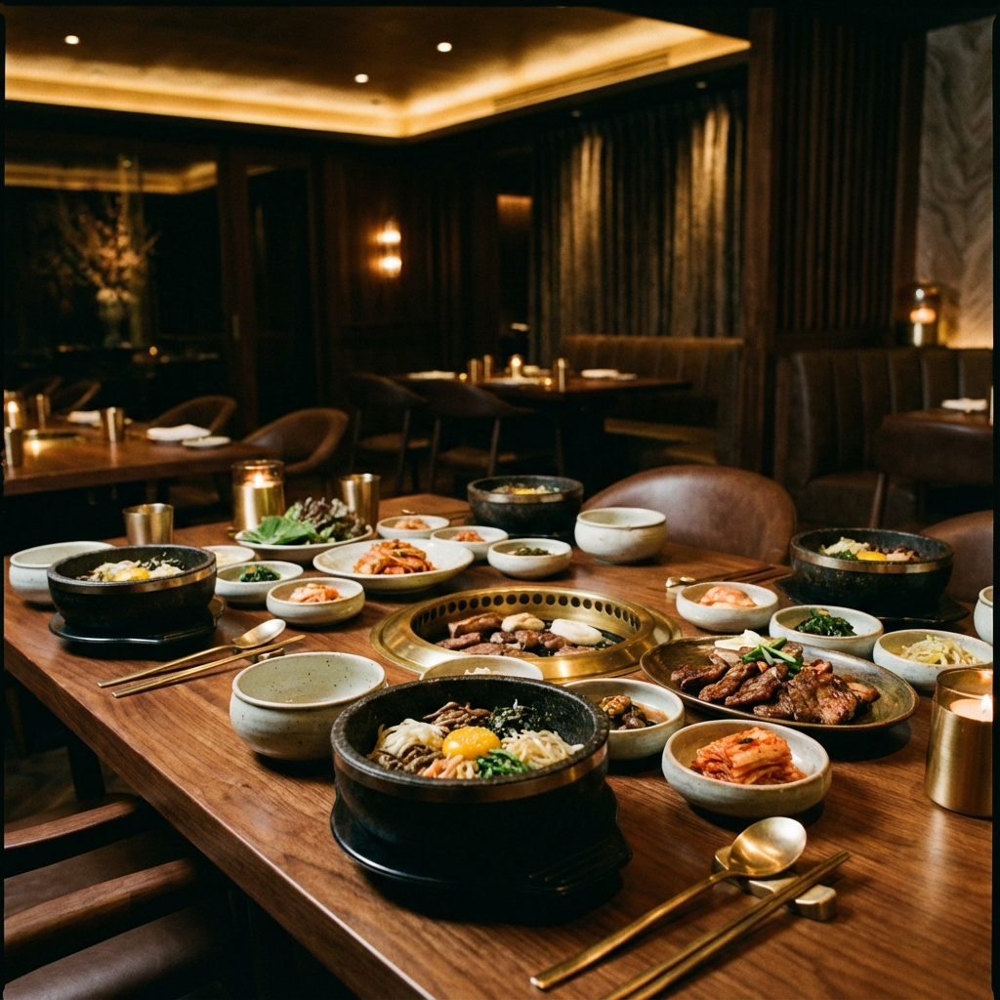

<!DOCTYPE html>
<html lang="de">

<head>
    <meta charset="UTF-8">
    <meta name="viewport" content="width=device-width, initial-scale=1.0">
    <title>Surasang | Fine Korean Dining</title>
    <meta name="description"
        content="Experience the authentic taste of Korea at Surasang. Premium Korean BBQ, Bibimbap, and traditional dishes served in an elegant modern atmosphere.">
    <link rel="stylesheet" href="styles.css">
    <link rel="icon" href="assets/images/favicon.ico" type="image/x-icon">
</head>

<body>

    <nav id="navbar">
        <a href="#" class="brand">SURASANG</a>
        

            

                <button class="lang-btn" data-lang="en">EN</button>
                <button class="lang-btn active" data-lang="de">DE</button>
                <button class="lang-btn" data-lang="ko">KR</button>
            

            <a href="#home" data-i18n="nav_home">Home</a>
            <a href="#menu" data-i18n="nav_menu">Menu</a>
            <a href="#experience" data-i18n="nav_experience">Experience</a>
            <a href="#location" data-i18n="nav_location">Location</a>
        

        

            

                <button class="lang-btn" data-lang="en">EN</button>
                <button class="lang-btn active" data-lang="de">DE</button>
                <button class="lang-btn" data-lang="ko">KR</button>
            

            <a href="#reservation" class="btn nav-btn" data-i18n="nav_book">Book a Table</a>
            <button class="mobile-nav-toggle" id="mobileNavToggle">
                
                
                
            </button>
        

    </nav>

    <section id="home" class="hero">
        <h1 data-i18n="hero_title">The King's Table</h1>
        
A modern interpretation of royal Korean cuisine. Elevating traditional flavors through
            contemporary techniques and seasonal ingredients.

        <a href="#menu" class="btn" data-i18n="hero_btn">Explore Menu</a>
    </section>

    <section id="menu">
        

            Our Selection
            <h2 data-i18n="menu_title">Signature Dishes</h2>
        

        

            

                
                

                    <h3 data-i18n="item_galbi_title">Prime Galbi</h3>
                    $48
                    
Hand-carved premium beef short ribs marinated in our house-made
                        soy-pear sauce, grilled to perfection.

                

            

            

                
                

                    <h3 data-i18n="item_bibimbap_title">Heritage Bibimbap</h3>
                    $28
                    
Sizzling stone bowl rice with seasonal mountain vegetables,
                        heritage grains, and aged gochujang.

                

            

            

                
                

                    <h3 data-i18n="item_hanjeongsik_title">Chef's Hanjeongsik</h3>
                    $85
                    
A curated course of 12 traditional Korean dishes, highlighting
                        the diversity of regional flavors.

                

            

            

                
                

                    <h3 data-i18n="item_bulgogi_title">Spicy Pork Bulgogi</h3>
                    $32
                    
Thinly sliced pork marinated in a spicy gochujang sauce,
                        char-grilled with scallions and onions.

                

            

            

                
                

                    <h3 data-i18n="item_pajeon_title">Seafood Pajeon</h3>
                    $24
                    
Traditional Korean pancake made with plenty of scallions and a
                        variety of fresh seafood.

                

            

            

                
                

                    <h3 data-i18n="item_stew_title">Aged Kimchi Jjigae</h3>
                    $22
                    
Rich and savory stew made with our 2-year aged kimchi, pork belly, and
                        silky tofu.

                

            

        

    </section>

    <section id="experience" class="info-section">
        

            Atmosphere
            <h2 data-i18n="exp_title">An Elevated Experience</h2>
            
At Surasang, we believe dining is more
                than just a meal. It's a journey through history, culture, and craftsmanship. Our space combines minimal
                Korean aesthetics with modern luxury to create an íntimate environment for unforgettable moments.

            <a href="#" class="btn" data-i18n="exp_btn">Gallery</a>
        

        

            
        

    </section>

    <section id="location" style="background-color: var(--bg-dark);">
        

            Join Us
            <h2 data-i18n="loc_title">Location & Hours</h2>
        

        

            

                <h3 style="color: var(--primary-color); margin-bottom: 1rem;" data-i18n="loc_address">Address</h3>
                
123 Seoul Avenue New York, NY 10001

            

            

                <h3 style="color: var(--primary-color); margin-bottom: 1rem;" data-i18n="loc_hours">Hours</h3>
                
Tue - Thu: 5pm - 10pm Fri - Sat: 5pm - 11pm Sun: 4pm - 9pm

            

            

                <h3 style="color: var(--primary-color); margin-bottom: 1rem;" data-i18n="loc_contact">Contact</h3>
                
+1 (212) 555-0199 hello@surasang.com

            

        

    </section>

    <section id="reservation"
        style="padding: 10rem 10%; background: linear-gradient(rgba(0,0,0,0.8), rgba(0,0,0,0.8)), url('assets/images/bbq.png'); background-size: cover; background-position: center;">
        

            Reserve a Table
            <h2 data-i18n="res_title" style="color: var(--primary-color);">Join Us Tonight</h2>
        

        <form style="max-width: 800px; margin: 0 auto; display: grid; grid-template-columns: 1fr 1fr; gap: 2rem;">
            <input type="text" data-i18n="res_name" placeholder="Full Name"
                style="padding: 1rem; background: rgba(255,255,255,0.1); border: 1px solid rgba(255,255,255,0.2); color: #fff; font-family: inherit;">
            <input type="email" data-i18n="res_email" placeholder="Email Address"
                style="padding: 1rem; background: rgba(255,255,255,0.1); border: 1px solid rgba(255,255,255,0.2); color: #fff; font-family: inherit;">
            <input type="date"
                style="padding: 1rem; background: rgba(255,255,255,0.1); border: 1px solid rgba(255,255,255,0.2); color: #fff; font-family: inherit;">
            <select
                style="padding: 1rem; background: rgba(255,255,255,0.1); border: 1px solid rgba(255,255,255,0.2); color: #888; font-family: inherit;">
                <option data-i18n="res_guests">Number of Guests</option>
                <option data-i18n="res_guests_2">2 People</option>
                <option data-i18n="res_guests_4">4 People</option>
                <option data-i18n="res_guests_6">6+ People</option>
            </select>
            <button type="button" class="btn" data-i18n="res_confirm"
                style="grid-column: span 2; cursor: pointer; background: transparent;">Confirm Reservation</button>
        </form>
    </section>

    <footer>
        
SURASANG

        

            
&copy; 2024 Surasang Korean Dining. All rights reserved.

        

        

            <a href="#" style="font-size: 0.7rem;">Instagram</a>
            <a href="#" style="font-size: 0.7rem;">Facebook</a>
        

    </footer>

    
</body>

</html>