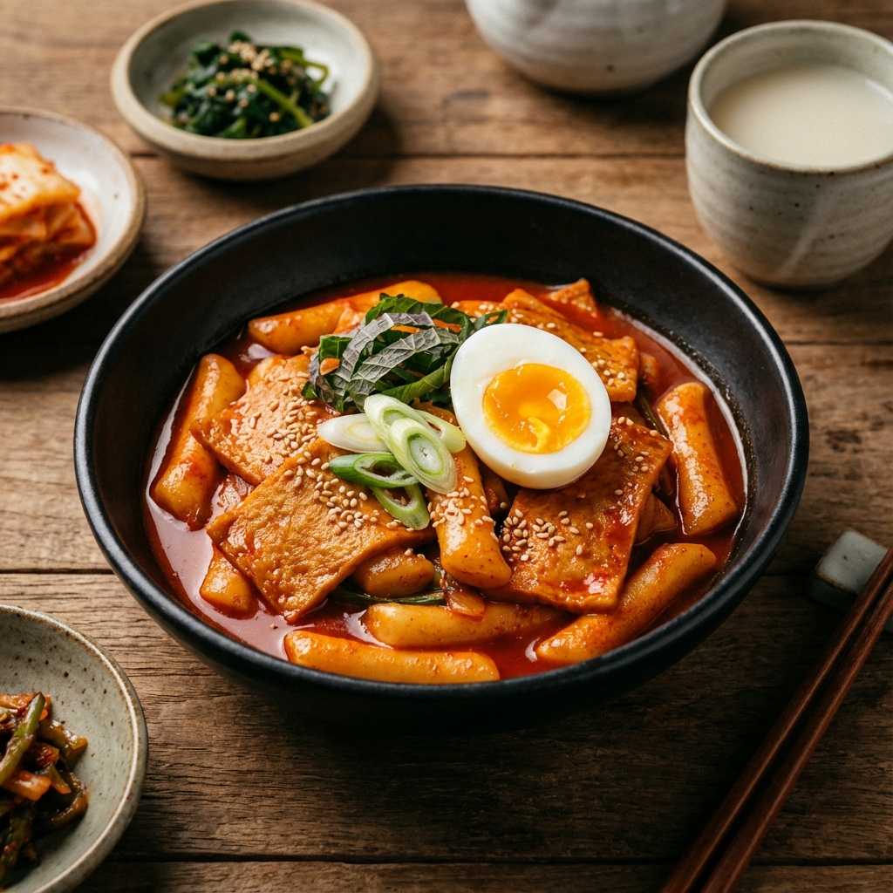
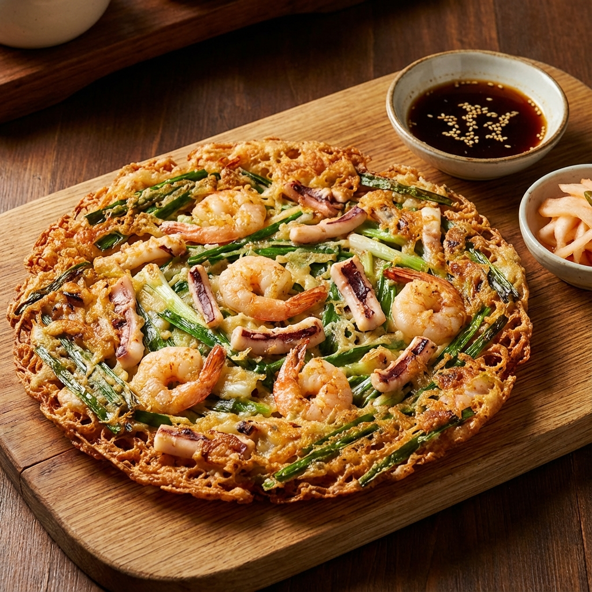
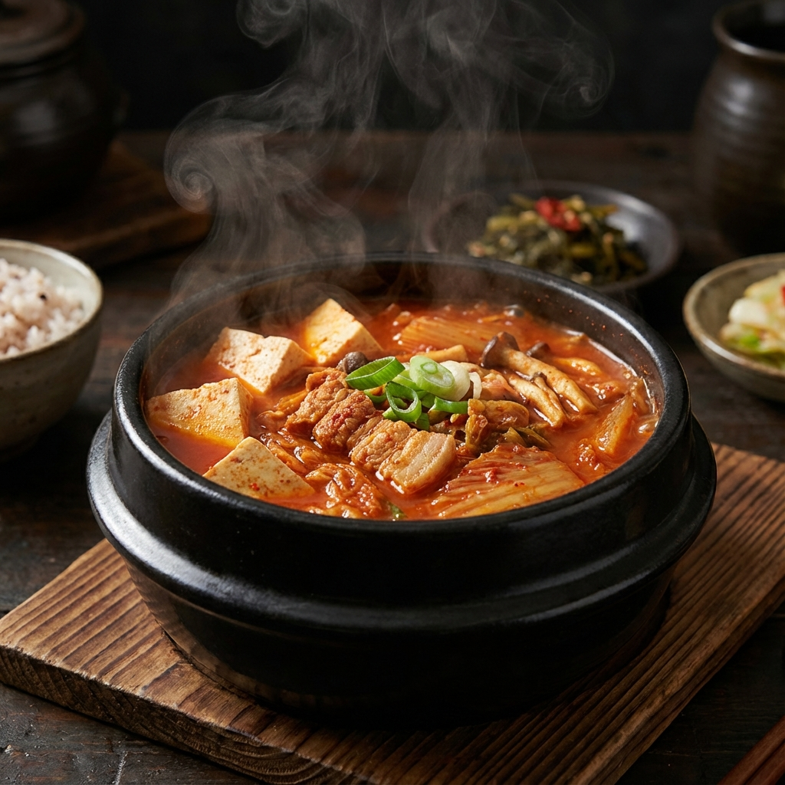

<!DOCTYPE html>
<html lang="de">

<head>
    <meta charset="UTF-8">
    <meta name="viewport" content="width=device-width, initial-scale=1.0">
    <title>Surasang | Fine Korean Dining</title>
    <meta name="description"
        content="Experience the authentic taste of Korea at Surasang. Premium Korean BBQ, Bibimbap, and traditional dishes served in an elegant modern atmosphere.">
    <link rel="stylesheet" href="styles.css">
    <link rel="icon" href="assets/images/favicon.ico" type="image/x-icon">
</head>

<body>

    <nav id="navbar">
        <a href="#" class="brand">SURA</a>
        

            

                <button class="lang-btn" data-lang="en">EN</button>
                <button class="lang-btn active" data-lang="de">DE</button>
                <button class="lang-btn" data-lang="ko">KR</button>
            

            <a href="#home" data-i18n="nav_home">Home</a>
            <a href="#menu" data-i18n="nav_menu">Menu</a>
            <a href="#experience" data-i18n="nav_experience">Experience</a>
            <a href="#location" data-i18n="nav_location">Location</a>
        

        

            

                <button class="lang-btn" data-lang="en">EN</button>
                <button class="lang-btn active" data-lang="de">DE</button>
                <button class="lang-btn" data-lang="ko">KR</button>
            

            <button class="mobile-nav-toggle" id="mobileNavToggle">
                
                
                
            </button>
        

    </nav>

    <section id="home" class="hero">
        <h1 data-i18n="hero_title">The King's Table</h1>
        
A modern interpretation of royal Korean cuisine. Elevating traditional flavors through
            contemporary techniques and seasonal ingredients.

        <button class="btn" data-i18n="hero_btn">Speisekarte</button>
    </section>

    <section id="menu">
        

            Our Selection
            <h2 data-i18n="menu_title">Signature Dishes</h2>
        

        

            

                
                

                    <h3 data-i18n="item_galbi_title">Bulgogi</h3>
                    17.90€
                    
Thinly sliced beef marinated in our house-made
                        soy sauce, grilled to perfection.

                

            

            

                
                

                    <h3 data-i18n="item_bibimbap_title">Dolsot Bibimbap</h3>
                    14.90€
                    
Sizzling stone bowl rice with seasonal mountain vegetables,
                        heritage grains, and aged gochujang.

                

            

            

                
                

                    <h3 data-i18n="item_hanjeongsik_title">Ddokbboki</h3>
                    10.90€
                    
Spicy stir-fried rice cakes with fish cakes and vegetables in a sweet and spicy sauce.

                

            

            

                
                

                    <h3 data-i18n="item_bulgogi_title">Japchae</h3>
                    13.50€
                    
Stir-fried sweet potato glass noodles with colorful vegetables and savory sauce.

                

            

            

                
                

                    <h3 data-i18n="item_pajeon_title">Haemul Pajeon</h3>
                    13.50€
                    
Traditional Korean pancake made with plenty of scallions and a
                        variety of fresh seafood.

                

            

            

                
                

                    <h3 data-i18n="item_stew_title">Kimchi Jjigae</h3>
                    14.90€
                    
Rich and savory stew made with our 2-year aged kimchi, pork belly, and
                        silky tofu.

                

            

        

    </section>

    <section id="experience" class="info-section">
        

            Atmosphere
            <h2 data-i18n="exp_title">An Elevated Experience</h2>
            
At Surasang, we believe dining is more
                than just a meal. It's a journey through history, culture, and craftsmanship. Our space combines minimal
                Korean aesthetics with modern luxury to create an íntimate environment for unforgettable moments.

            <button class="btn" data-i18n="exp_btn">Gallery</button>
        

        

            
        

    </section>

    <section id="location" style="background-color: var(--bg-dark);">
        

            Join Us
            <h2 data-i18n="loc_title">Location & Hours</h2>
        

        

            

                <h3 style="color: var(--primary-color); margin-bottom: 1rem;" data-i18n="loc_address">Address</h3>
                
Königsbrücker Straße 50 01099 Dresden

            

            

                <h3 style="color: var(--primary-color); margin-bottom: 1rem;" data-i18n="loc_hours">Opening Hours</h3>
                
Dienstag - Sonntag: 17:00 - 22:00 Montag: Ruhetag

            

            

                <h3 style="color: var(--primary-color); margin-bottom: 1rem;" data-i18n="loc_contact">Contact</h3>
                
0351 810 747 89 suradresden@gmail.com

            

        

    </section>

    <footer>
        
SURA

        

            
&copy; 2024 Sura Korean Restaurant Dresden. All rights reserved.

        

        

            <a href="#" style="font-size: 0.7rem;">Instagram</a>
            <a href="#" style="font-size: 0.7rem;">Facebook</a>
        

    </footer>

    
</body>

</html>